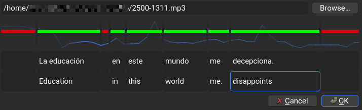

# Spoken words
This is an Anki add-on to help you learn to recognise and translate words in foreign languages based on their use in spoken sentences.
It enables a thorough, idiosyncratic version of "sentence mining".

Notes of the new [types]( https://docs.ankiweb.net/getting-started.html#note-types ) `Sentence Listening [n]` hold spoken sentences broken into audio clips, written words to transcribe each clip, and written words in another language to translate each clip.
`n` is the number of separate clips in each sentence, each corresponding to a word or phrase.
These notes make two kinds of [cards]( https://docs.ankiweb.net/getting-started.html#notes--fields ): Write and Translate.
The add-on centres around a GUI to conveniently make these notes, which creates the note types as needed.



## Setup
Install it from AnkiWeb, when I post it there.
Until then, download the ZIP and install it manually with Anki's menu:
```sh
# you downloaded linearithmic-toset-master.zip
unzip linearithmic-toset-master.zip
cd linearithmic-toset-master
# GitHub wraps a directory layer in ZIPs, which Anki needs not
zip linearithmic_toset.zip *
# Anki -> top menu -> Tools -> Add-ons -> Install from file... -> find that zip you just made
cp start_beep.mp3 end_beep.mp3 .../collection.media/ # import beep clips as media items
```

You will need [NumPy]( https://numpy.org/ ) and [FFmpeg]( https://ffmpeg.org/ ) installed for the add-on to work as intended.

If needed, restart Anki.
If it still doesn't work, raise an issue here with the error message and/or faulty behaviour.

## Cards
A `Sentence Listening [n]` note makes twice as many cards as there are audio clips given for the sentence to be studied.
New cards appear when new clips are added to a note.
Existing cards go blank, and [can be readily deleted]( https://docs.ankiweb.net/templates/generation.html#card-generation--deletion ), if the speech clip that guided that card is set blank.

In either kind of card, you hear the full sentence spoken from the clips you saved.
One word or phrase (one clip) is the target of your focus in any card.
This target word is indicated as such with beeps right before and after it, which are respectively high- and low-pitched.

In a Write card, you see the instruction &#x270E; (pencil), and your task is to recognise the target word as spoken:
> Q: (spoken) la educación en este (high beep) mundo (low beep) me decepciona (end) &#x270E;
>
> A: mundo

In a Translate card, you see the instruction &#x21C4; (arrows), and your task is to recall what the target word means in another language, normally your native one:
> Q: (spoken) la educación en este (high beep) mundo (low beep) me decepciona (end) &#x21C4;
>
> A: world

## Editor
In the top menu's Tools category will be "Edit Sentence Listening".
That action opens the GUI for a new note, if [the card browser]( https://docs.ankiweb.net/browsing.html ) is closed.
If the card browser is open, the GUI applies to the note focused in the browser, a case for which the add-on is not designed and will act unpredictably.

The editor, from top to bottom, shows an audio file picker, a horizontal bar, and two rows of text-boxes.
Your first step in this editor should be to pick the audio file holding a full spoken sentence to study.
A blue waveform should appear behind the bar, to visualise the audio file.

To extract words and phrases as clips, middle-click the bar to specify where a clip ends.
You can left-click and drag an endpoint to move it and adjust the length of the clip before and after it.
You can right-click an endpoint to toggle whether the clip before it will be saved for the note.
Any of these changes will play the clip just before the endpoint you adjusted.

Each clip that will be saved, marked in green, should be annotated with the word it speaks.
You can do so in the text-boxes below.
Put the word actually spoken in the upper box below a clip's interval.
Put the word as translated in the lower box.

After you check that the timings of your clips match the times at which words are spoken, click OK to create the note.
